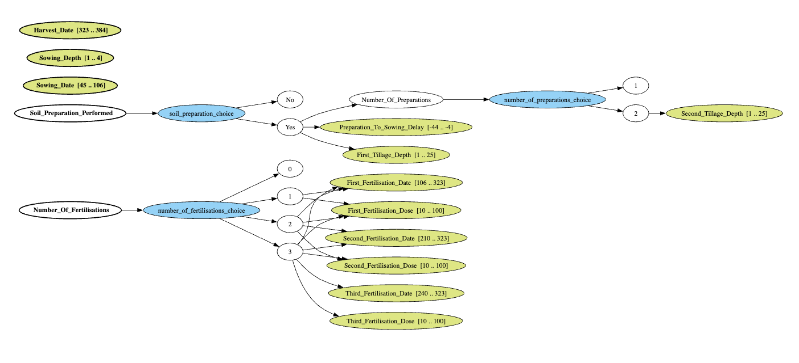

# Sensitivity Analysis MAELIA — terrainSA et HSIC-ANOVA

Ce dépôt rassemble une chaîne de travail minimale pour explorer la sensibilité d'un modèle agro-écologique MAELIA sur un terrain contrôlé, `terrainSA`, puis visualiser les résultats avec une application web et une analyse HSIC-ANOVA.

## 1. Organisation du dépôt

Le dépôt est volontairement resserré autour des éléments utiles à la reproduction et à la lecture des résultats.

- `maelia_sa_pipeline/` contient l'application web. Son guide d'utilisation détaillé est dans [`maelia_sa_pipeline/README.md`](maelia_sa_pipeline/README.md). L'application retient quatre analyses : ANOVA à un facteur, HSIC-ANOVA, indices de Sobol par PCE et courbes PDP/ICE par sous-espace.
- `communication/` contient les supports de présentation et documents de communication associés au projet.
- `figs/` contient uniquement les figures affichées dans ce README : l'espace SMT MAELIA, les figures HSIC-ANOVA principales et deux exemples de courbes PDP/ICE par sous-espace.
- `simulations/` contient le notebook de génération du plan SMT, le notebook de lancement terrainSA, le script de construction du terrain projet-local, le terrain `gama_includes/terrainSA`, et les logs `log_terrainSA`.
- `analysis/` contient le notebook HSIC-ANOVA `hsic_anova_analysis.ipynb`, le notebook `pdp_ice_par_sous_espace.ipynb` (courbes PDP/ICE pour chacun des 12 sous-espaces SMT) et les outils dans `analysis/tools/`.

Les dépendances Python sont listées dans `requirements.txt`. Les sorties temporaires de l'application web et les caches Python sont ignorés par Git.

## 2. Reproduire l'analyse

**Étape 0 — Construire ou inspecter le plan SMT.**  
Ouvrir [`simulations/smt_generation.ipynb`](simulations/smt_generation.ipynb). Ce notebook décrit l'espace de paramètres hiérarchique utilisé pour MAELIA : nombre de fertilisations, préparation du sol, dates d'opérations, profondeurs et doses. Il produit aussi la représentation de l'espace SMT/ADSG.

**Étape 1 — Construire ou vérifier `terrainSA`.**  
`terrainSA` est un terrain projet-local placé dans `simulations/gama_includes/terrainSA`. Il peut être reconstruit avec `simulations/build_terrainSA_project.py` à partir du terrain MAELIA de référence, sans modifier le workspace GAMA.

**Étape 2 — Lancer les simulations.**  
Exécuter [`simulations/batch_simulations_smt_terrainSA.ipynb`](simulations/batch_simulations_smt_terrainSA.ipynb). Le notebook utilise `terrainSA`, génère les fichiers `dateDose_smt_*`, lance GAMA en headless, puis écrit les sorties dans `simulations/log_terrainSA`.

**Étape 3 — Vérifier les logs et le dataset.**  
Le dossier `simulations/log_terrainSA` doit contenir les dossiers de runs `terrainSA_smt_*` ainsi que `dataset_metamodel.csv` et `dataset_metamodel_features.csv`. Le fichier `dataset_metamodel.csv` relie les sorties MAELIA à la matrice du plan SMT ; il est indispensable pour l'analyse.

**Étape 4 — Exécuter HSIC-ANOVA.**  
Ouvrir [`analysis/hsic_anova_analysis.ipynb`](analysis/hsic_anova_analysis.ipynb). Le notebook charge `dataset_metamodel.csv`, importe `analysis/tools/hsic_methods.py`, calcule les termes HSIC-ANOVA et génère les tableaux et figures d'influence.

**Étape 5 — Tracer les courbes PDP/ICE par sous-espace.**  
Ouvrir [`analysis/pdp_ice_par_sous_espace.ipynb`](analysis/pdp_ice_par_sous_espace.ipynb). Le notebook partitionne `dataset_metamodel.csv` selon les 12 sous-espaces de l'espace SMT hiérarchique, entraîne un métamodèle par sous-espace sur ses seules variables continues actives, puis trace la courbe PDP (effet moyen) et le faisceau ICE (scénarios individuels) de chaque variable.

**Étape 6 — Explorer les résultats dans l'application web.**  
Depuis la racine du dépôt :

```bash
python -m uvicorn maelia_sa_pipeline.api:app --reload
```

L'interface demande le chemin vers les logs, par exemple `simulations/log_terrainSA`. Le README de l'application détaille les mesures affichées et les analyses disponibles.

## 3. Résultats terrainSA

`terrainSA` est construit pour isoler l'effet des paramètres techniques. Il correspond à la parcelle `beauce_5_1` clonée 100 fois dans le même ilot `beauce_5`. Les clones partagent donc le même contexte pédologique et météorologique : même sol, même zone météo, même géométrie de référence. Ce choix réduit l'effet confondant du climat et du type de sol pour concentrer l'analyse sur les opérations agricoles.

### Un espace de conception hiérarchique à 12 sous-espaces

L'espace d'exploration SMT/ADSG est hiérarchique : certains paramètres n'existent que si une opération associée existe. Trois variables de décision structurent l'espace — le nombre de fertilisations (`0, 1, 2, 3`), la présence d'une préparation du sol (`oui/non`) et, le cas échéant, le nombre de reprises (`1, 2`). Leurs combinaisons valides définissent **12 sous-espaces**, chacun activant un sous-ensemble différent des 15 paramètres. Ainsi les dates et doses de fertilisation ne sont actives que lorsqu'une fertilisation a lieu, et les profondeurs de préparation seulement lorsqu'une préparation est prévue.



### Résultats HSIC-ANOVA

Les figures suivantes décomposent, pour chaque sortie, la dépendance statistique mesurée par noyaux entre les paramètres et la sortie. Elles ne doivent **pas** être lues comme des indices de Sobol : HSIC-ANOVA mesure une dépendance non linéaire globale et gère les paramètres actifs par intermittence de l'espace hiérarchique.

La figure principale classe les termes par contribution au HSIC global, pour les trois sorties. Les effets d'ordre 1 (paramètre seul) dominent, mais des interactions d'ordre 2 apparaissent nettement pour le rendement : le couple nombre d'apports × dose du premier apport y pèse à lui seul environ 8 %.


Lecture par sortie :

- **Azote lixivié (`N_lixi`)** est piloté par la fertilisation : les doses et dates des apports dominent (dose du troisième apport ~23 %, date du deuxième apport ~19 %, dose du deuxième apport ~17 %), le nombre d'apports comptant pour ~8 %.
- **Variation du carbone organique (`dCorg`)** dépend surtout de la fertilisation et de la fenêtre culturale : date du deuxième apport (~36 %), nombre d'apports (~20 %), dose du premier apport (~14 %), puis date de récolte (~8 %) et présence d'une préparation du sol (~5 %).
- **Rendement (`rdt`)** répond d'abord à la quantité d'azote apportée : nombre d'apports (~37 %), dose du premier apport (~23 %) et date du deuxième apport (~20 %), avec une interaction marquée nombre d'apports × dose du premier apport (~8 %).

En regroupant les paramètres par famille agronomique, la même hiérarchie se lit à un niveau plus synthétique : la fertilisation — nombre d'apports, dates et doses réunis — domine les trois sorties, la préparation du sol et le calendrier semis/récolte jouant un rôle secondaire.


### Courbes PDP/ICE par sous-espace

L'analyse HSIC agrège tout l'espace hiérarchique. Pour la compléter, le notebook [`analysis/pdp_ice_par_sous_espace.ipynb`](analysis/pdp_ice_par_sous_espace.ipynb) descend **à l'intérieur de chacun des 12 sous-espaces** : à structure d'itinéraire technique fixée, il entraîne un métamodèle (forêt aléatoire) sur les seules variables continues actives du sous-espace, puis trace pour chaque variable la courbe PDP (effet marginal moyen, ligne foncée) et le faisceau ICE (scénarios individuels, lignes claires). Chaque sortie est traitée séparément, soit 36 figures.

L'exemple ci-dessous correspond au sous-espace le plus riche — trois fertilisations et deux reprises de préparation, soit douze variables actives — pour le rendement.


À l'opposé, le sous-espace minimal — aucune fertilisation, sans préparation — n'active que trois variables (dates de semis et de récolte, profondeur de semis).


À l'intérieur de chaque sous-espace, les métamodèles sont nettement prédictifs (Q² typiquement de 0,7 à 0,99) et les PDP révèlent des réponses agronomiques interprétables. Pour le rendement, on retrouve la courbe classique de réponse à l'azote : le rendement croît avec chaque dose d'apport puis sature au-delà d'environ 50 kgN/ha, et diminue lorsque le premier apport est trop tardif ; les profondeurs de travail et la date de semis ont un effet faible. Les faisceaux ICE resserrés autour des PDP indiquent des effets marginaux stables d'un scénario à l'autre.

Dans ce cadre contrôlé, les résultats doivent être interprétés comme une sensibilité des sorties à la stratégie technique, et non comme une sensibilité générale de MAELIA à tous les contextes pédoclimatiques.
