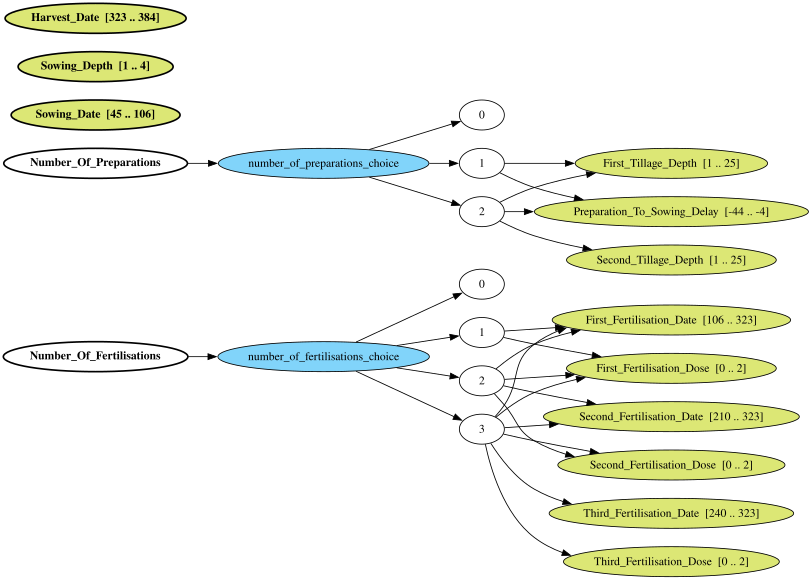
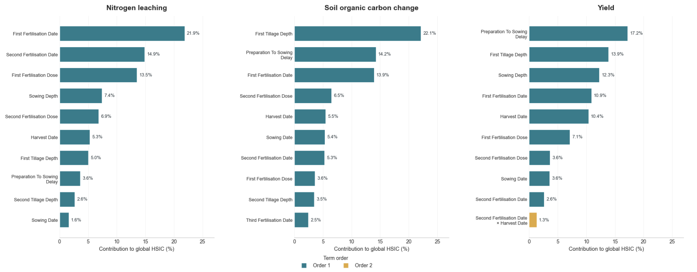
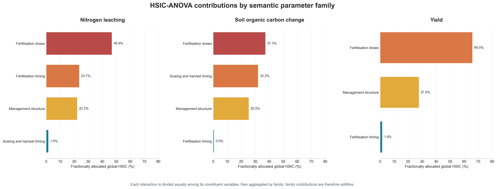
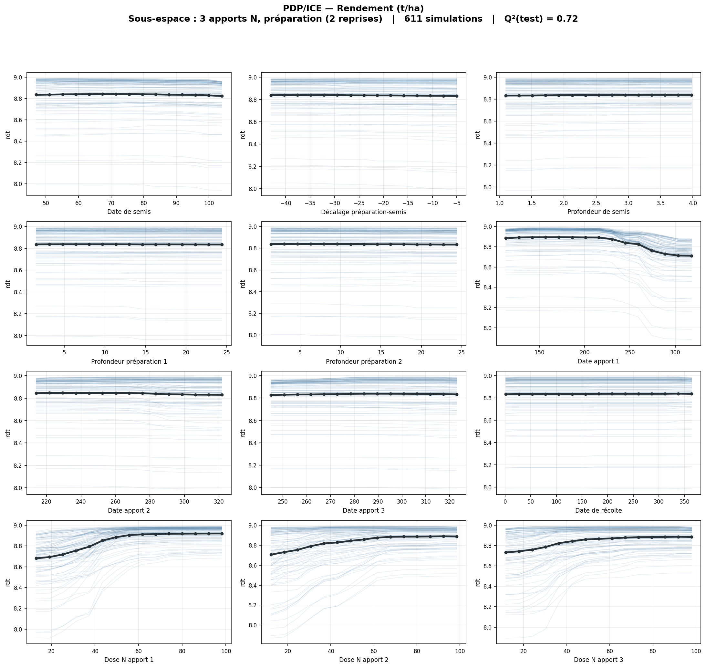
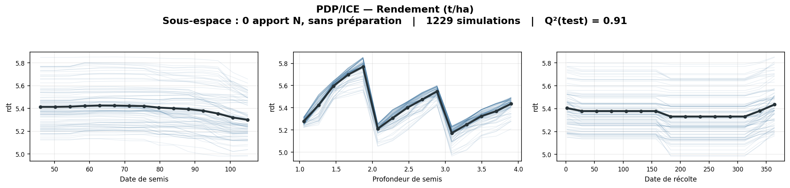

# Sensitivity Analysis MAELIA

Analyse de sensibilité du modèle agro-écologique MAELIA sur un terrain contrôlé, `terrainSA`. On y explore l'effet des règles de décision de l'agriculteur, du climat et du type de sol sur trois sorties : le rendement, l'azote lixivié et la variation du carbone organique du sol.

## Organisation du dépôt

**`app_maelia/`** est l'application. Elle fait tout le parcours, de la description de l'espace à explorer jusqu'aux résultats, en passant par la génération des fichiers d'entrée MAELIA et le lancement de GAMA. Elle vit dans un seul dossier et n'écrit que dedans.

Pour la prendre en main, le mieux est de suivre **[le tutoriel](app_maelia/TUTORIEL.md)**. Il part de zéro, sans aucune simulation, et va jusqu'aux résultats commentés. Chaque étape indique ce que vous devez voir à l'écran pour savoir que vous êtes sur la bonne voie. Le [README de l'application](app_maelia/README.md) détaille ensuite le fonctionnement : les deux modes de travail, la façon dont le plan est tiré, les chemins vers MAELIA et GAMA, et comment ouvrir le terrain dans QGIS.

**`analysis/`** contient les deux notebooks de référence. [`hsic_anova_analysis.ipynb`](analysis/hsic_anova_analysis.ipynb) applique la décomposition HSIC-ANOVA hiérarchique aux sorties MAELIA. [`pdp_ice_par_sous_espace.ipynb`](analysis/pdp_ice_par_sous_espace.ipynb) trace les courbes PDP et ICE dans chacun des douze sous-espaces. Les outils communs sont dans `analysis/tools/`.

**`simulations/`** garde les scripts de la première campagne, celle des 5000 points. On y trouve aussi `doe_matrix_terrainSA.npy`, qui est la seule trace du tirage utilisé à l'époque. Ce tirage n'était reproductible par aucune graine, donc le fichier compte.

**`figs/`** ne contient que les figures reprises ci-dessous.

Les dépendances sont dans `requirements.txt`.

## Ce que le terrain permet de voir

`terrainSA` isole l'effet des paramètres techniques. C'est la parcelle `beauce_5_1`, clonée 100 fois dans le même ilot. Les clones partagent le sol, la zone météo et la géométrie, ce qui écarte l'effet confondant du contexte pédoclimatique.

Le climat et le sol peuvent maintenant varier à leur tour, mais pas par le même mécanisme. MAELIA affecte le climat à l'ilot en retenant la zone météo qui le recouvre le plus, donc faire varier le climat demande des ilots séparés dans l'espace. Le sol, lui, est un simple attribut de l'ilot. Rien ne se déplace, donc plusieurs ilots peuvent tenir au même endroit avec des sols différents. Les deux se croisent alors dans un même plan.

## L'espace de conception

L'espace est hiérarchique. Certains paramètres n'existent que si l'opération correspondante a lieu. Deux variables de décision le structurent : le nombre de fertilisations (0 à 3) et le nombre de préparations du sol (0 à 2). Leurs combinaisons donnent **12 sous-espaces**, chacun activant un sous-ensemble différent des 14 paramètres.

Le plan est tiré en fixant d'abord ce squelette. Chacune des douze combinaisons reçoit la même part du budget, puis un hypercube latin répartit les paramètres à l'intérieur. Aucun sous-espace ne se retrouve sous-doté par hasard, et le même numéro de graine redonne le même plan.

## Résultats

### L'itinéraire technique

Sur les 5000 simulations à climat et sol fixés, la fertilisation domine les trois sorties. Les figures ci-dessous décomposent la dépendance mesurée par noyaux entre paramètres et sorties. Ce ne sont pas des indices de Sobol : HSIC-ANOVA mesure une dépendance non linéaire et sait traiter des paramètres qui n'existent que par intermittence.

Les effets d'ordre 1 dominent, avec les doses de fertilisation mais aussi le nombre d'apports, qui ressort comme un moteur structurel. De vraies interactions d'ordre 2 et 3 apparaissent, en particulier pour le rendement où le couple nombre d'apports x dose du premier apport pèse environ 8 %.

Par sortie :

- **Azote lixivié.** Dose du deuxième apport 12 %, nombre d'apports 9 %, date du deuxième apport 9 %, dose du premier apport 9 %, dose du troisième 7 %.
- **Carbone organique.** Date de récolte 26 %, dose du deuxième apport 13 %, dose du premier 11 %, nombre d'apports 10 %, nombre de préparations 9 %.
- **Rendement.** Dose du deuxième apport 21 %, dose du premier 19 %, nombre d'apports 18 %, plus l'interaction nombre d'apports x dose du premier apport à 8 %.

Regroupés par famille, les doses pèsent de 37 % à 66 % selon la sortie. La structure de l'itinéraire, c'est-à-dire le nombre d'apports et de préparations, arrive deuxième partout, entre 22 % et 28 %.

### Courbes PDP et ICE

HSIC agrège tout l'espace. Pour voir ce qui se passe à structure d'itinéraire fixée, le notebook [`pdp_ice_par_sous_espace.ipynb`](analysis/pdp_ice_par_sous_espace.ipynb) entre dans chacun des douze sous-espaces. Il entraîne un métamodèle sur les seules variables actives, puis trace pour chaque variable l'effet marginal moyen en ligne foncée et les scénarios individuels en lignes claires.

Le sous-espace le plus riche, trois fertilisations et deux reprises, compte douze variables actives.

Le plus pauvre n'en a que trois : dates de semis et de récolte, profondeur de semis.

Les métamodèles y sont prédictifs, avec des Q² de 0,7 à 0,99, et les courbes se lisent en agronome. Le rendement suit la réponse classique à l'azote : il croît avec chaque dose puis sature au-delà d'environ 50 kgN/ha, et baisse quand le premier apport arrive trop tard. Les profondeurs de travail et la date de semis pèsent peu. Les faisceaux ICE restent serrés autour des courbes moyennes, signe d'effets marginaux stables d'un scénario à l'autre.

## Portée

Ces résultats mesurent la sensibilité des sorties à la stratégie technique, sur un terrain construit pour cela. Ils ne disent pas la sensibilité de MAELIA à tous les contextes pédoclimatiques. La campagne climat élargit la portée sur un axe, celle du sol reste à faire.
