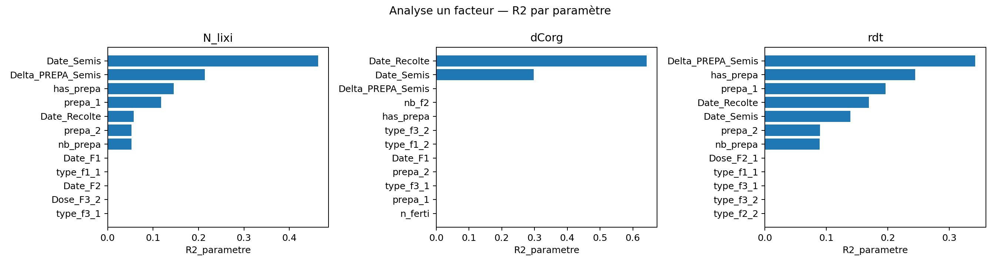
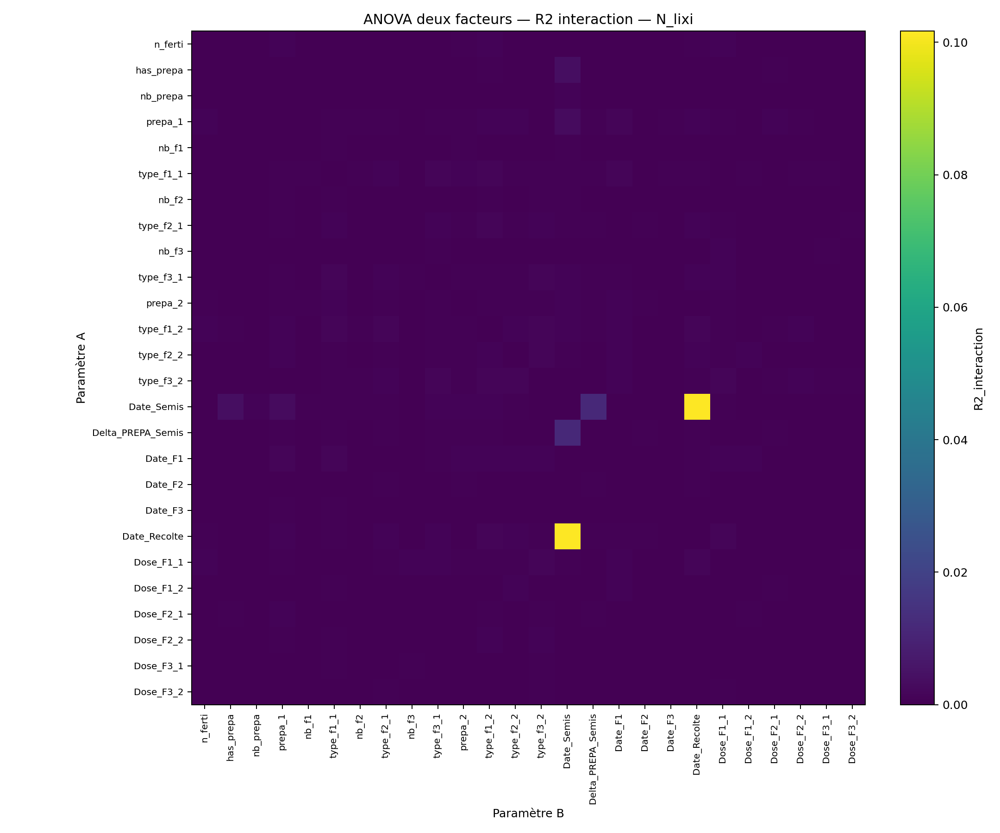
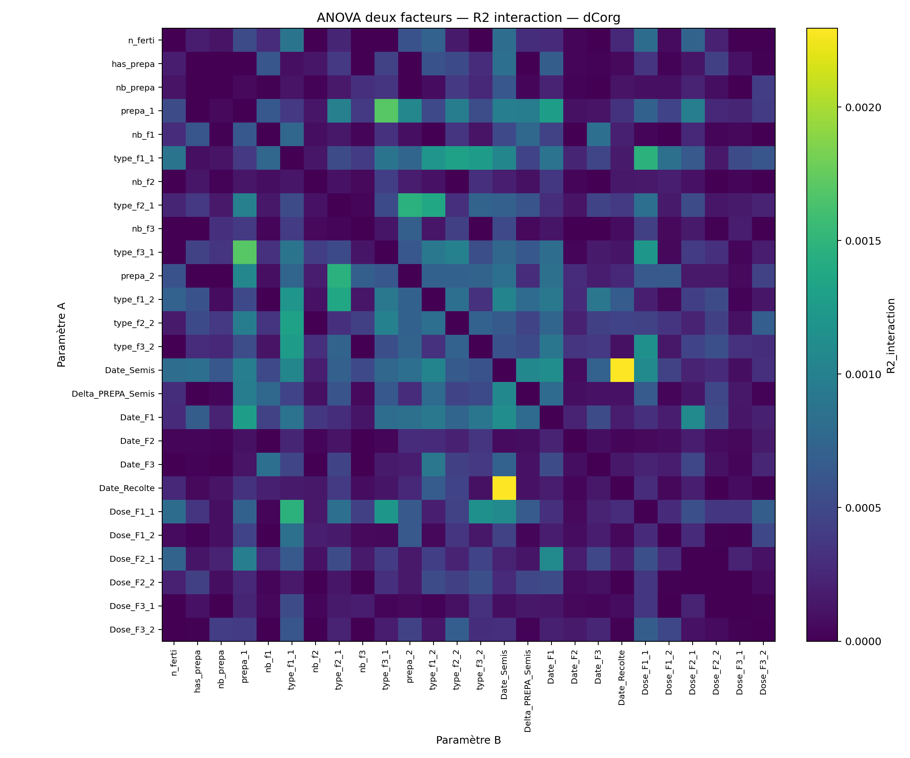
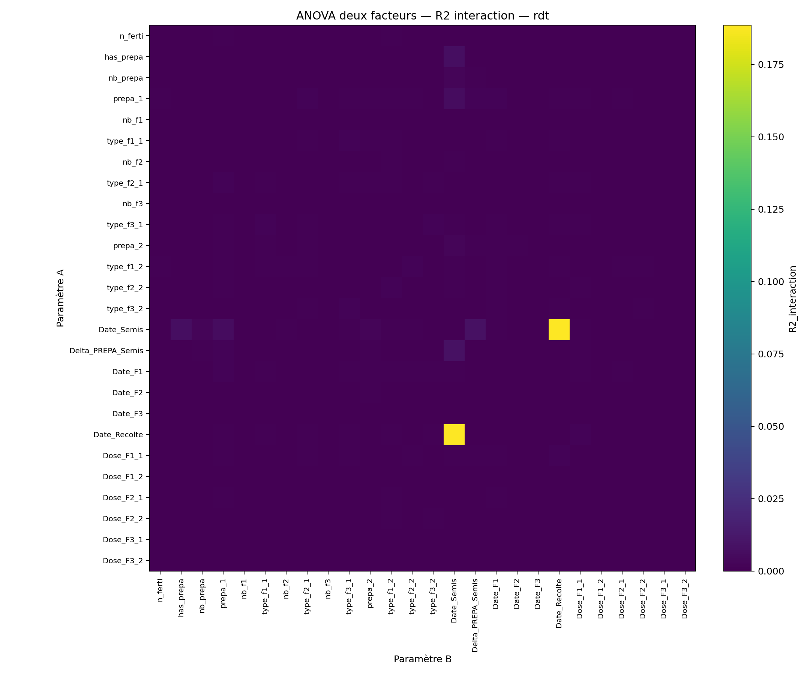
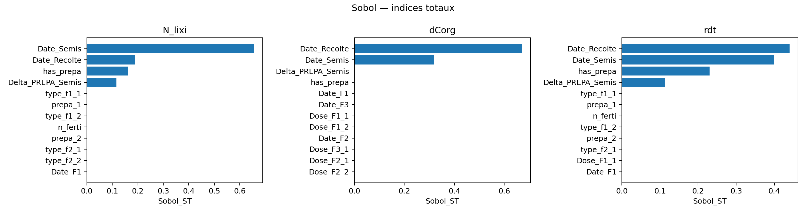
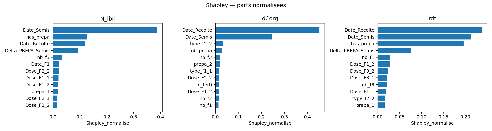

# Analyse de sensibilité MAELIA

Ce dépôt regroupe les notebooks, scripts et figures utilisés pour analyser la sensibilité des sorties MAELIA. La démarche suit trois étapes :

1. analyser les premiers résultats lorsque le sol et le climat varient ;
2. isoler les opérations techniques avec `terrainSA` et entraîner un métamodèle ;
3. identifier des seuils locaux avec des arbres de décision.

Les figures présentées ci-dessous sont celles générées par les notebooks et présentes dans le dépôt GitHub.

## Partie 1 - Premières analyses : sol et climat variables

Les premières analyses sont réalisées sur un terrain où le climat et le type de sol changent entre parcelles. Dans ce cadre, les sorties sont fortement structurées par le contexte pédoclimatique. Les paramètres techniques existent bien dans le signal, mais leur contribution est largement masquée par les contrastes entre zones météo et types de sol.

Ce résultat est central pour l'interprétation : lorsque le sol et le climat varient, l'analyse de sensibilité répond d'abord à une question spatiale, pas seulement agronomique. Elle montre quelles zones et quels sols expliquent les variations, mais ne permet pas encore d'isoler proprement les effets des itinéraires techniques.


Les distributions par groupes sol-climat confirment cette lecture : les sorties sont nettement séparées par les contextes environnementaux.


L'entraînement d'un métamodèle XGBoost n'a pas donné de résultats suffisamment satisfaisants sur ces données pédoclimatiques variables. D'où la construction de `terrainSA`.

## Partie 2 - terrainSA : opérations techniques et métamodèle

Pour isoler les leviers techniques, `terrainSA` clone la parcelle `beauce_5_1`. Les simulations comparent alors des itinéraires techniques dans un contexte constant : même sol, même géométrie et même zone météo. Cette construction réduit le bruit lié au milieu et rend les effets agronomiques plus lisibles.

Le plan SMT actuel encode les dates en jours de campagne, avec `1 = 1er août`. Les principaux paramètres calendaires sont `Date_Semis`, `Delta_PREPA_Semis`, `Date_F1`, `Date_F2`, `Date_F3` et `Date_Recolte`.

### Métamodèle

Le notebook compare ExtraTrees, XGBoost et Gaussian Process. Les meilleurs modèles retenus sont :

| Sortie | Métamodèle retenu | Q2 test | R2 entraînement effectif |
|---|---|---:|---:|
| `N_lixi` | ExtraTrees | 0.987 | 0.999 |
| `dCorg` | XGBoost | 0.999 | 0.999 |
| `rdt` | ExtraTrees | 0.985 | 0.999 |

Ces scores indiquent que le métamodèle est suffisamment fidèle pour soutenir les analyses globales sur `terrainSA`. Les performances très élevées sont cohérentes avec le fait que le terrain est volontairement homogénéisé : le signal provient principalement des opérations techniques et de leur calendrier.

### ANOVA à un facteur

L'ANOVA/Kruskal à un facteur met en évidence des leviers différents selon les sorties :

| Sortie | Paramètres dominants | Lecture rapide |
|---|---|---|
| `N_lixi` | `Date_Semis`, `Delta_PREPA_Semis`, `has_prepa`, `prepa_1`, `Date_Recolte` | la lixiviation est d'abord gouvernée par le calendrier semis-préparation-récolte ; |
| `dCorg` | `Date_Recolte`, `Date_Semis` | le carbone organique dépend surtout de la durée et du positionnement du cycle ; |
| `rdt` | `Delta_PREPA_Semis`, `has_prepa`, `prepa_1`, `Date_Recolte`, `Date_Semis` | le rendement est sensible au délai préparation-semis et au calendrier de fin de cycle. |



### Interactions à deux facteurs

Les heatmaps ci-dessous affichent uniquement le `R2_interaction`. Les interactions sont plus faibles que les effets principaux, mais elles précisent les zones où un paramètre dépend du niveau d'un autre. Pour `N_lixi`, les interactions concernent surtout la préparation du sol et le délai préparation-semis. Pour `dCorg` et `rdt`, les couples autour de `Date_Semis`, `Date_Recolte` et `Delta_PREPA_Semis` sont les plus interprétables.







### Sobol et Shapley

Les indices de Sobol d'ordre total et les valeurs de Shapley confirment que les dates de campagne dominent les sorties :

| Sortie | Principaux facteurs Sobol total |
|---|---|
| `N_lixi` | `Date_Semis`, `Date_Recolte`, `has_prepa`, `Delta_PREPA_Semis` |
| `dCorg` | `Date_Recolte`, `Date_Semis` |
| `rdt` | `Date_Recolte`, `Date_Semis`, `has_prepa`, `Delta_PREPA_Semis` |





## Partie 3 - Seuils locaux par arbres de décision

Le notebook `analysis/Analyse_seuils_decision_tree.ipynb` prolonge l'analyse en cherchant des seuils interprétables. L'objectif n'est pas de remplacer le métamodèle global, mais d'obtenir des règles locales : au-delà de tel seuil, la réponse change de régime.

Les arbres de régression contraints obtiennent les performances suivantes :

| Sortie | Q2 test arbre | Paramètres principalement utilisés |
|---|---:|---|
| `N_lixi` | 0.887 | `Date_Semis`, `Delta_PREPA_Semis`, `Date_Recolte`, `has_prepa` |
| `dCorg` | 0.966 | `Date_Recolte`, `Date_Semis` |
| `rdt` | 0.879 | `Delta_PREPA_Semis`, `Date_Recolte`, `Date_Semis`, `has_prepa` |

Pour `N_lixi`, les premiers seuils portent sur `Date_Semis` autour de 73 jours de campagne, puis sur `Date_Recolte` et `Delta_PREPA_Semis`. Pour `dCorg`, le couple `Date_Recolte` / `Date_Semis` structure fortement les régimes. Pour `rdt`, les seuils combinent surtout délai préparation-semis, date de récolte et date de semis.


Les importances internes aux arbres résument ces règles : les dates de campagne dominent, tandis que les doses et types d'engrais ont ici un effet secondaire dans le contexte homogénéisé `terrainSA`.


## App web

L'app web permet de relancer une analyse complète depuis une interface locale. La synthèse ci-dessus reste toutefois fondée sur les figures générées par les notebooks et versionnées dans le dépôt.

```bash
/Users/benjamin/.pyenv/versions/MAELIA_SA/bin/python -m uvicorn maelia_sa_pipeline.api:app --host 127.0.0.1 --port 8000
```

Puis ouvrir : `http://127.0.0.1:8000`.

## Fichiers utiles

- Analyse terrainSA et métamodèles : `analysis/Analyse_terrainSA.ipynb`
- Analyse des seuils : `analysis/Analyse_seuils_decision_tree.ipynb`
- Résultats terrainSA notebook : `analysis/terrainSA_results/`
- Résultats arbres de décision notebook : `analysis/decision_tree_thresholds/`
- Notebook de lancement terrainSA : `simulations/batch_simulations_smt_terrainSA.ipynb`
- Figures historiques terrainTest : `figs/`
