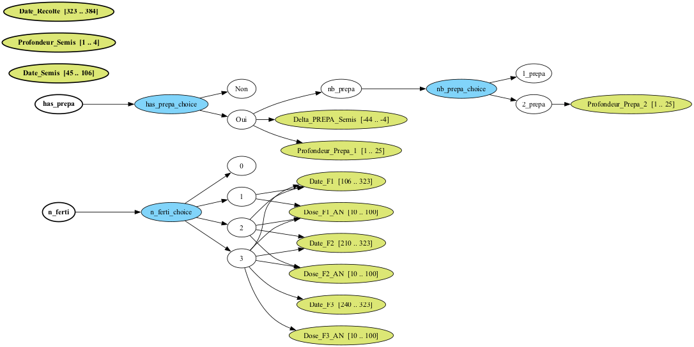
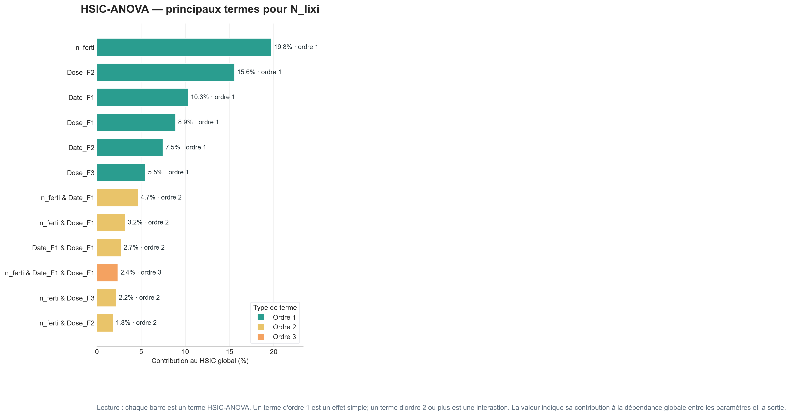
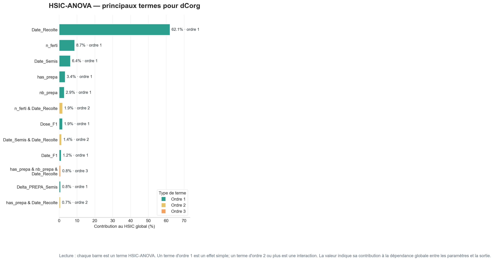
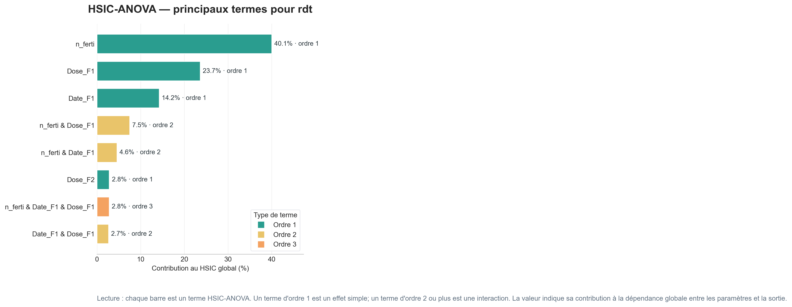
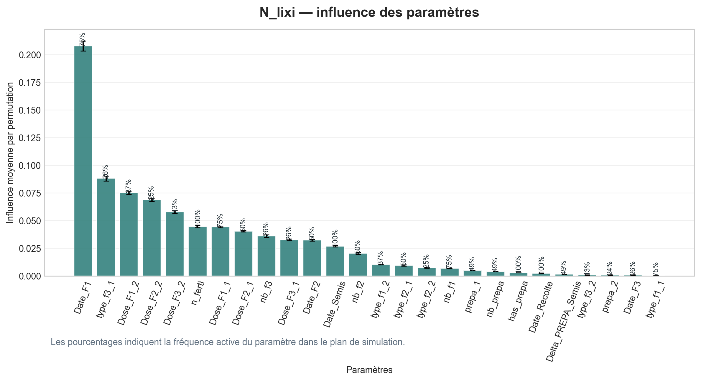
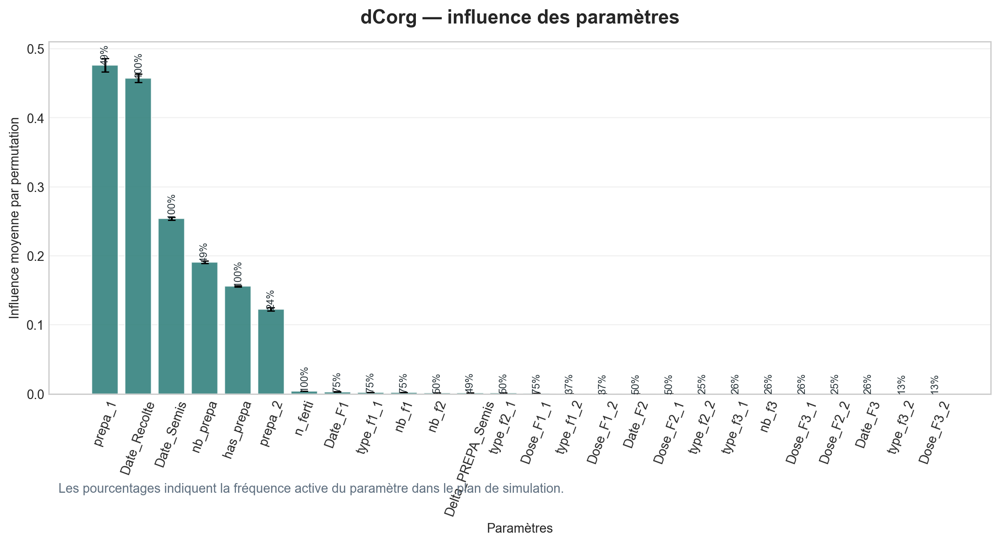
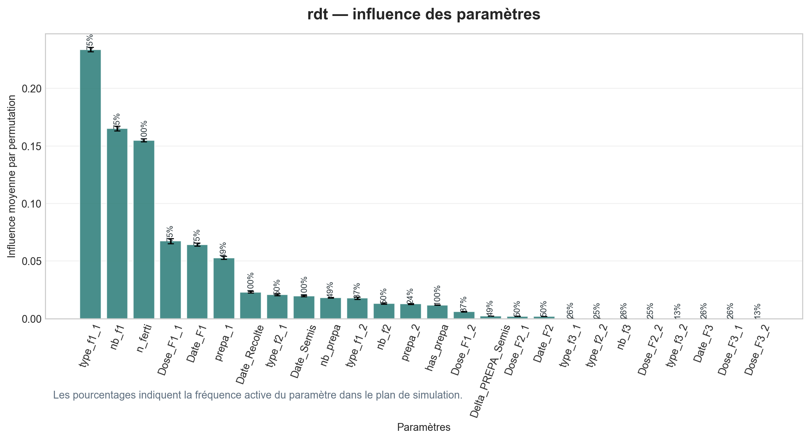

# Sensitivity Analysis MAELIA — terrainSA et HSIC-ANOVA

Ce dépôt rassemble une chaîne de travail minimale pour explorer la sensibilité d'un modèle agro-écologique MAELIA sur un terrain contrôlé, `terrainSA`, puis visualiser les résultats avec une application web et une analyse HSIC-ANOVA.

## 1. Organisation du dépôt

Le dépôt est volontairement resserré autour des éléments utiles à la reproduction et à la lecture des résultats.

- `maelia_sa_pipeline/` contient l'application web. Son guide d'utilisation détaillé est dans [`maelia_sa_pipeline/README.md`](maelia_sa_pipeline/README.md).
- `communication/` contient les supports de présentation et documents de communication associés au projet.
- `figs/` contient uniquement les figures affichées dans ce README : l'espace SMT MAELIA et les figures HSIC-ANOVA principales.
- `simulations/` contient le notebook de génération du plan SMT, le notebook de lancement terrainSA, le script de construction du terrain projet-local, le terrain `gama_includes/terrainSA`, et les logs `log_terrainSA`.
- `analysis/` contient le notebook `hsic_anova_analysis.ipynb` et les outils HSIC-ANOVA dans `analysis/tools/`.

Les dépendances Python sont listées dans `requirements.txt`. Les sorties temporaires de l'application web et les caches Python sont ignorés par Git.

## 2. Reproduire l'analyse

**Étape 0 — Construire ou inspecter le plan SMT.**  
Ouvrir [`simulations/smt_generation.ipynb`](simulations/smt_generation.ipynb). Ce notebook décrit l'espace de paramètres hiérarchique utilisé pour MAELIA : nombre de fertilisations, préparation du sol, dates d'opérations, profondeurs et doses. Il produit aussi la représentation de l'espace SMT/ADSG.

**Étape 1 — Construire ou vérifier `terrainSA`.**  
`terrainSA` est un terrain projet-local placé dans `simulations/gama_includes/terrainSA`. Il peut être reconstruit avec `simulations/build_terrainSA_project.py` à partir du terrain MAELIA de référence, sans modifier le workspace GAMA.

**Étape 2 — Lancer les simulations.**  
Exécuter [`simulations/batch_simulations_smt_terrainSA.ipynb`](simulations/batch_simulations_smt_terrainSA.ipynb). Le notebook utilise `terrainSA`, génère les fichiers `dateDose_smt_*`, lance GAMA en headless, puis écrit les sorties dans `simulations/log_terrainSA`.

**Étape 3 — Vérifier les logs et le dataset.**  
Le dossier `simulations/log_terrainSA` doit contenir les dossiers de runs `terrainSA_smt_*` ainsi que `dataset_metamodel.csv` et `dataset_metamodel_features.csv`. Le fichier `dataset_metamodel.csv` relie les sorties MAELIA à la matrice du plan SMT ; il est indispensable pour l'analyse.

**Étape 4 — Exécuter HSIC-ANOVA.**  
Ouvrir [`analysis/hsic_anova_analysis.ipynb`](analysis/hsic_anova_analysis.ipynb). Le notebook charge `dataset_metamodel.csv`, importe `analysis/tools/hsic_methods.py`, calcule les termes HSIC-ANOVA et génère les tableaux et figures d'influence.

**Étape 5 — Explorer les résultats dans l'application web.**  
Depuis la racine du dépôt :

```bash
python -m uvicorn maelia_sa_pipeline.api:app --reload
```

L'interface demande le chemin vers les logs, par exemple `simulations/log_terrainSA`. Le README de l'application détaille les mesures affichées et les options de pipeline.

## 3. Résultats terrainSA

`terrainSA` est construit pour isoler l'effet des paramètres techniques. Il correspond à la parcelle `beauce_5_1` clonée 100 fois dans le même ilot `beauce_5`. Les clones partagent donc le même contexte pédologique et météorologique : même sol, même zone météo, même géométrie de référence. Ce choix réduit l'effet confondant du climat et du type de sol pour concentrer l'analyse sur les opérations agricoles.

L'espace d'exploration est hiérarchique : certains paramètres n'existent que si une opération associée existe. Par exemple, les dates et doses de fertilisation ne sont actives que lorsque le scénario contient une fertilisation, et les profondeurs de préparation ne sont actives que lorsqu'une préparation du sol est présente.



Les figures suivantes présentent les principaux termes HSIC-ANOVA par sortie. Elles ne doivent pas être lues comme des indices de Sobol : elles décomposent une dépendance statistique mesurée par noyaux entre les paramètres et chaque sortie MAELIA.







Les histogrammes ci-dessous comptent la fréquence d'apparition des paramètres dans les principaux termes retenus. Ils donnent une lecture complémentaire : un paramètre souvent présent dans les termes importants peut agir seul ou via des interactions.







Dans ce cadre contrôlé, les résultats doivent être interprétés comme une sensibilité des sorties à la stratégie technique, et non comme une sensibilité générale de MAELIA à tous les contextes pédoclimatiques. L'intérêt de HSIC-ANOVA est précisément de conserver une lecture globale tout en tenant compte de dépendances non linéaires et d'interactions entre paramètres actifs dans l'espace SMT.
